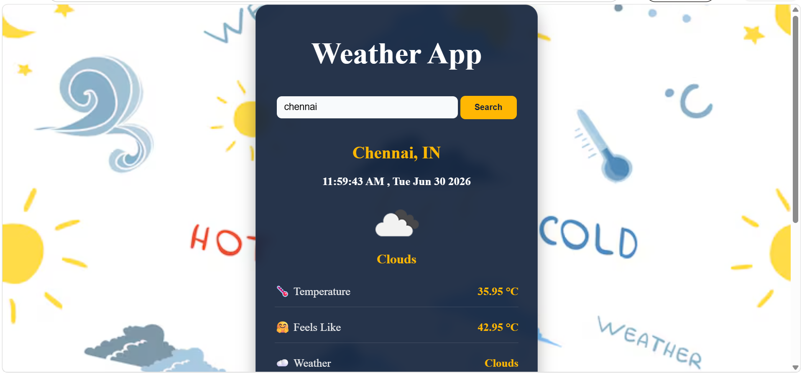
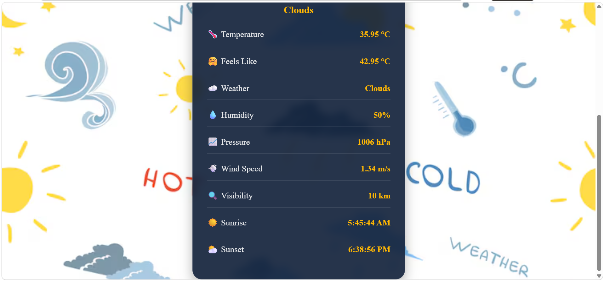

# 🌦️ Weather App

- A simple and responsive Weather Application that allows users to search for any city and view real-time weather information.
- The app fetches weather data from a weather API and displays important weather details in a clean and user-friendly interface.

## 🌐 Live Demo
🔗 **Website:** 
>Deployment : Hosted using **Github Pages**

## 📌 Features
- 🔍 Search weather by city name
- ⏱️ Live date and time display (updates every second)
- 🌡️ Current temperature
- 🥵 Feels like temperature
- ☁️ Weather condition
- 💧 Humidity
- 📊 Atmospheric pressure
- 💨 Wind speed
- 👀 Visibility
- 🌅 Sunrise time
- 🌇 Sunset time
- 📱 Responsive and attractive UI
  
## 🛠️ Technologies Used
- HTML5
- CSS3
- JavaScript 
- Weather API (e.g., OpenWeatherMap API)

## 📂 Project Structure
```
weather-app/
│── images/
│── index.html
│── style.css
│── script.js
│── README.md
```

## 📖 How It Works
1. Enter the name of a city.
2. Click the **Search** button.
3. The application sends a request to the weather API.
4. The API returns real-time weather data.
5. The weather information is displayed on the screen.

## 🌍 API Data Displayed
- Temperature (°C)
- Feels Like Temperature
- Weather Description
- Humidity (%)
- Pressure (hPa)
- Wind Speed (m/s)
- Visibility (km)
- Sunrise Time
- Sunset Time

## 📷 Preview
## 📷 Home Page

## 🌦️ Weather Screen



**⭐ If you found this project helpful, consider giving it a star !**
